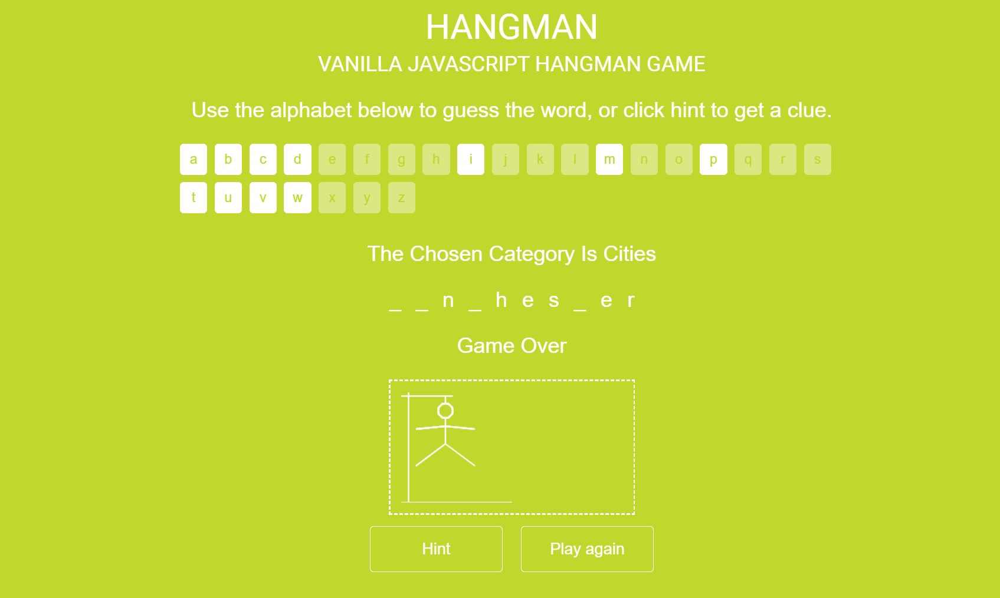

# Create a hangman game

## Overview
Create a hangman game! <br>
Example of what we want to accomplish [here](https://codepen.io/cathydutton/pen/ldazc). You can use it to know exactly what the game is about, but do not copy it. Use your own way. Be as creative as you can! (You don't need to implement Hint button)


### Requirements

1. HTML:
    1. Add buttons that correspond to each letter from a to z.
    2. Add a section that will hold the blanks that are going to be equal to the number of characters for the current word.
    3. Add a div to show the man who's going to be hanged if you lose.
    4. Add a counter from 10 that will decrease by 1 with every wrong guess.
    4. Add a button to play again.

2. JS:
    1. At the beginning use fetch API to retrieve a random word from this api https://random-word-api.herokuapp.com/word?number=1. Make the blanks equal the number of letters in the random word.
    2. Everytime the user clicks on one of the letters the following should happen:
        1. The random word is search through to find if it contains the clicked letter, if the clicked letter is part of the random word's letters then it gets shown up instead of the space, if not, then the lives counter is decreased by one. In some rare cases a clicked letter corresponds to two letters in the generated word, if that happens then show both words.
        2. The button becomes disabled and should only work once.
    3. If the lives counter reaches 0 then the game is over and the hangman should be HANGED! 👨‍🦱🔪
    4. Clicking on the play again button should do the whole process again.

## Coding Phase

- Use `projects` in github, they can be useful in arranging the tasks or issues with description and image so everyone knows what they should do
- To track your work its better to add columns like `in progress`, `done` , and `closed`
- Minimize the communication required in Slack, try to make depend on review comments and task descriptions
- You should create a branch locally with the naming convention `[issue id + issue title]` and then push it and submit a Pull Request that must be close that issue. Look [here](https://github.blog/2013-05-14-closing-issues-via-pull-requests/) to know more.
- Make the tasks small but more, this can reduce conflicts and won't overwhelm you.

## Git

**Pull Requests**

- Go to the issues board and create a new issue with the task assigned to you.
- Assign the issue to yourself so others know who is working on this issue.
- After finishing the work, push your code and assign your team membmers on that pull request so they can review the code.

**Commit Message Format**

Each commit message consists of a **header**, a **body** and a **footer**. The header has a special format that includes a **type** and a **subject**:

```
<type>: <subject>
<BLANK LINE>
<body>
```

The **header** is mandatory, while the **body** is optional but highly encouraged.

**Type**

Must be one of the following:

- **Build**: Changes that affect the build system or external dependencies (example scopes: gulp, broccoli, npm)
- **Doc**: Documentation only changes
- **Feat**: A new feature
- **Fix**: A bug fix
- **Perf**: A code change that improves performance
- **Refactor**: A code change that neither fixes a bug nor adds a feature
- **Style**: Changes that do not affect the meaning of the code (white-space, formatting, missing semi-colons, etc)

**Subject**

The subject contains a succinct description of the change:

- use the imperative, present tense: “change” not “changed” nor “changes”
- don’t capitalize the first letter
- no dot (.) at the end

**Body**

Just as in the **subject**, use the imperative, present tense: “change” not “changed” nor “changes”. The body should include the motivation for the change and contrast this with previous behavior.

## The Code

- The code should be totally clean and checked line by line before committing and pushing.
- You shouldn't leave any unnecessary comments in the code.
- Don't leave any logs inside the code.
- All variables should be `const` except for specific cases where you will need to use `let`
- Variables should use camelCase naming convention
- CSS classes should follow BEM naming convention. *You can find more about it [here](http://getbem.com/naming/).*
- Leave only one empty line between CSS classes. This also goes for different purpose code blocks (like `imports` and variables under it).
- Make sure your naming is right and not confusing i.e. the `navbar` shouldn't be named `header` or when you fetch `movies` your function should return `movies` not `data`
- Make sure you clean your imported modules or files that you don't use before committing. The same goes for any variable, function or piece of code not used.
- Don't repeat yourself (DRY). Make sure the code you write is reusable and reduce repetition of information of all kinds. For example, don't write two functions that do the same or almost the same job. *Read more about DRY [here](https://en.wikipedia.org/wiki/Don't_repeat_yourself).*

If you have issues, google them.
<br>
If you still have issues, talk to your friends in the same room.
<br>
If you still have issues, talk to your instructors.
<br>
<br>


NOTE: Be creative with the game's mechanics and design!!! 
Have fun, and Good luck :D 
